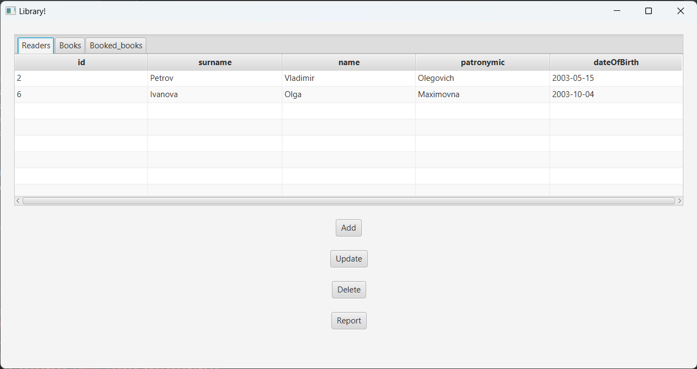
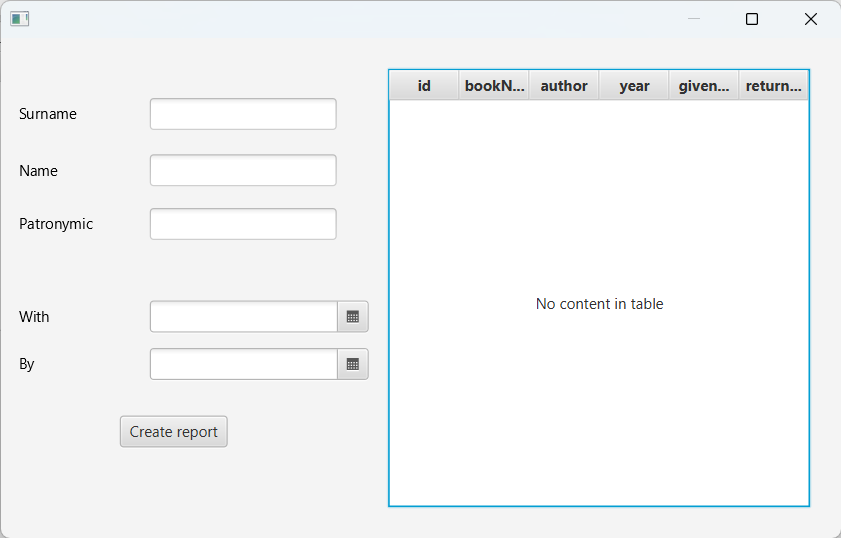

# CFT_TestTask

This JavaFX Application allows work with simple library database.

### About Database

Application works with PostgreSQL database and uses HikariDataSource for organize pool of connections.
Project directory contains three .sql scripts:
 1. schema.sql - creating tables;
2. data.sql - inserting data in tables;
3. triggers.sql - creating triggers on delete because tables have references between each other.

### About Application

Application allows to add, update, delete and show database entries.
Also was added an opportunity to create a report for person (surname, name, patronymic) book bookings in selected period.

### About Code Architecture

Book, Reader and Booking classes are extend from basic class Basic. It helps to avoid code duplication and save Book/Reader/Booking object to one Basic's variable (example: HelloController::onDeleteClick).

There also Report and ReportLine classes for reports creation.

For each .fxml file application has controller.

Application can build with Maven.